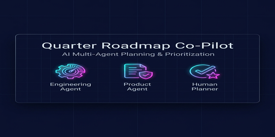
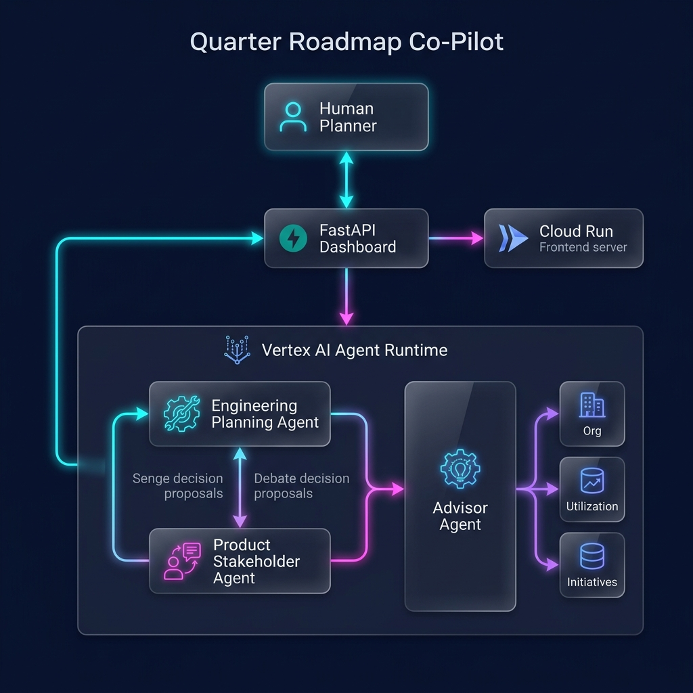

# 🗺️ Quarter Roadmap Co-Pilot

<p align="center">
  
</p>

**Two agents, one messy quarter, a human in the middle.**

> An ADK 2.0 multi-agent system that helps a planner close out a quarter that didn't finish cleanly. A **Product Stakeholder Agent** and an **Engineering Planning Agent** debate each carried-over or newly-proposed item; the human makes the final call. A free-form **Advisor Agent** answers follow-up questions about capacity, staffing, and trade-offs.

| | |
| --- | --- |
| **Track** | Agents for Business |
| **Capstone** | 5-Day AI Agents Intensive Vibe Coding Course with Google (Kaggle, July 2026) |
| **Demo company** | PromptJang (synthetic — webhook reliability & observability platform). All names carry a `(mock)` suffix. |
| **Live demo** | [quarter-roadmap-copilot-711733680987.us-west1.run.app](https://quarter-roadmap-copilot-711733680987.us-west1.run.app) *(Cloud Run; redeploy may rotate the URL — see [§6](#6-deploy))* |

---

## Contents

1. [The problem](#1-the-problem)
2. [Why agents (and why three)](#2-why-agents-and-why-three)
3. [Architecture](#3-architecture)
4. [The build (Antigravity + Agents CLI)](#4-the-build-antigravity--agents-cli)
5. [Quick start](#5-quick-start)
6. [Deploy](#6-deploy)
7. [Concept coverage](#7-concept-coverage)
8. [Project structure](#8-project-structure)
9. [Security](#9-security)
10. [License](#10-license)

---

## 1. The problem

Real quarterly planning is messy. A quarter never finishes cleanly — items end up **in-progress**, **partially-done**, **blocked**, or **not-started**. The next-quarter conversation is then:

> *"Given all this half-done / stuck / untouched work + the new things we want + what customers and the market are signaling + the capacity we actually have — what do we do with each?"*

That synthesis — across **state × feedback × capacity** — is exactly the reasoning surface an agent is good at. Existing PM tools list items; they don't *reason* across three forces and surface the decisions that actually need a human.

## 2. Why agents (and why three)

A single LLM call could draft a prioritization. But the realistic tension in roadmap planning is **between departments with opposing mandates**: Product wants to maximize customer value; Engineering wants to protect sustainable utilization. Forcing one model to play both sides flattens that tension.

This project uses **two ADK `LlmAgent`s with distinct mandates** that reason in sequence — the Planning Agent emits first (citing the capacity envelope + Q1/Q2 utilization history), then the Stakeholder Agent responds having seen those positions (citing customer/market/regulatory feedback). Where they disagree, the human decides on the board. That's honest multi-agent design: the agents embody the real organizational conflict instead of hiding it behind a polite compromise.

A third agent, the **Advisor**, handles everything that doesn't fit a structured decision card — "who can I move to Delivery?", "what's over capacity right now?" — grounded in the same org, utilization, and initiative data via tool calls, not the static dataset text.

## 3. Architecture



### Execution Flow

```
                                   START
                                     │
                          classify_input_node   (routes on '?' / question words)
                                     │
                  ┌──────────────────┴──────────────────┐
              route=review                          route=chat
                  │                                      │
       load_planning_state_node                    advisor_agent
     (reads app/data/*.json,                  (LlmAgent + read_org_tool /
      redacts PII, formats context)         read_utilization_tool / read_initiatives_tool)
                  │                                      │
            planning_agent                              END
       (LlmAgent, Eng stance
       -> AgentPositionsOutput)
                  │
      build_stakeholder_input_node
     (combines context + Eng positions)
                  │
           stakeholder_agent
       (LlmAgent, Product stance
       -> AgentPositionsOutput)
                  │
            summarize_node
     (-> PlanningBriefing for the UI)
                  │
                 END
```

- **`classify_input_node`** — a deterministic node that routes each request to the review chain or the chat advisor based on simple heuristics (question marks, question words).
- **`planning_agent`** — Engineering Planning Agent. Mandate: protect ≤100% utilization. Cites Q1/Q2 history (Ingestion peaked at 122% in Q1) and the capacity envelope.
- **`stakeholder_agent`** — Product Stakeholder Agent ("the other department"). Mandate: maximize customer value + protect revenue. Cites customer / market / regulatory feedback. Sees the Planning Agent's positions before responding.
- **`advisor_agent`** — free-form Q&A agent backing the dashboard's chat panel. Reads org structure, utilization history, and quarter initiatives through tools, and is instructed to match a named item's `owner_team` before recommending a person.
- **`load_planning_state_node`** — deterministic loader that also runs `redact_confidential` **before** any LLM call (the Security feature).
- **`summarize_node`** — combines both agents' positions into a `PlanningBriefing` with consensus/dispute counts.

See **[app/data/README.md](app/data/README.md)** for the dataset, the four decision candidates, and the capacity envelope that forces a decision, and **[docs/architecture.md](docs/architecture.md)** for the full Mermaid component + sequence diagrams and the Google Cloud deployment topology.

## 4. The build (Antigravity + Agents CLI)

This project was vibe-coded following Kaggle's 5-Day AI Agents course. The build workflow mirrors the public codelabs and uses **Google Antigravity** as the agentic IDE plus the **Agents CLI** for the agent lifecycle.

| Step | Tool | Codelab |
| --- | --- | --- |
| Author the ADK 2.0 graph + iterate on instructions | Antigravity IDE | [06 — Agent Lifecycle with Agents CLI + ADK 2.0](https://codelabs.developers.google.com/agents-cli-adk-lifecycle) |
| Install the toolchain + skills | `agents-cli` | [05 — Authoring Antigravity Skills](https://codelabs.developers.google.com/getting-started-with-antigravity-skills) |
| Security gate (Semgrep pre-commit + STRIDE skill) | Antigravity IDE | [08 — Secure Agentic Coding](https://codelabs.developers.google.com/secure-agentic-coding) |
| Deploy to Agent Runtime + Cloud Run | `agents-cli deploy` / `gcloud run deploy` | [10 — Deploy to Agent Runtime](https://codelabs.developers.google.com/enterprise-cloud-scale-deploying-the-expense-agent-to-agent-runtime-on-google-cloud) |

## 5. Quick start

### Prerequisites

- Python 3.11–3.13 (the project pins `>=3.11,<3.14`)
- [uv](https://docs.astral.sh/uv/) package manager
- Antigravity IDE (optional, for vibecoding edits) — [download](https://antigravity.google/download)
- A Gemini API key from [Google AI Studio](https://aistudio.google.com/apikey), **or** Vertex AI access (`gcloud auth application-default login`)

### Install

```bash
# 1. Clone
git clone https://github.com/marttp/20260704-quarter-roadmap-multi-agents.git
cd 20260704-quarter-roadmap-multi-agents

# 2. Install dependencies (creates .venv automatically via uv)
uv sync --extra all

# 3. Install the Agents CLI toolchain + its companion skills globally
#    (one-time; adds skills to ~/.agents/skills/ discovered by Antigravity)
uvx google-agents-cli setup
agents-cli info   # verify

# 4. Configure credentials — copy .env.example to .env and fill in ONE of:
cp .env.example .env
#   Option A: Gemini API key (simplest)      -> GEMINI_API_KEY=...
#   Option B: Vertex AI / Agent Runtime       -> GOOGLE_GENAI_USE_VERTEXAI=true,
#             GOOGLE_CLOUD_PROJECT=..., GOOGLE_CLOUD_LOCATION=...

# 5. Build the Vue dashboard (one-time, then after each frontend change)
make frontend-install   # npm install in frontend/
make frontend-build     # Vite build -> submission_frontend/static/spa/
```

### Run

```bash
# Backend (FastAPI on :8080) — serves /api/state, /api/review, /api/chat,
# /health, and the built Vue SPA. Falls back to the synthetic dataset for
# /api/review and /api/chat until AGENT_RUNTIME_ID is set (see §6).
make dashboard

# OR: Vue dev server (:5173) with HMR + hot proxy to the backend on :8080
#     (run `make dashboard` in one terminal, `make frontend-dev` in another)
make frontend-dev

# Local ADK web playground (interactive) — codelab 06 pattern
agents-cli playground

# Single-shot CLI run
agents-cli run "Review the Q3 plan and surface the decision_required items."
agents-cli run "Who can I move to Delivery to unblock Circuit Breakers?"

# Lint + auto-fix
agents-cli lint
agents-cli lint --fix

# Tests (25 pytest cases across unit + integration)
uv run pytest
```

## 6. Deploy

The agent and the dashboard deploy **separately**, to two different Google Cloud services, from the **same** root `Dockerfile`. The `CMD` reads an `APP_MODULE` env var to decide which FastAPI app to serve — Agent Runtime leaves it unset (defaults to the ADK agent app), Cloud Run sets it to serve the dashboard:

| Target | Serves | Entry module |
| --- | --- | --- |
| **Agent Runtime** | `app/agent.py`'s ADK workflow (`/api/reasoning_engine`, `/api/stream_reasoning_engine`, A2A routes) | `app.fast_api_app:app` (default) |
| **Cloud Run** | The FastAPI JSON API + built Vue SPA | `submission_frontend.main:app` (via `APP_MODULE`) |

### 6.1 Agent Runtime (the agent backend)

```bash
# 0. Google Cloud prerequisites
gcloud auth login
gcloud config set project YOUR_PROJECT_ID
gcloud services enable aiplatform.googleapis.com cloudbuild.googleapis.com

# 1. Deploy (5–10 minutes; updates the existing engine in place if
#    deployment_metadata.json already points at one)
make deploy-agent-runtime GOOGLE_CLOUD_PROJECT=YOUR_PROJECT_ID GOOGLE_CLOUD_LOCATION=us-west1

# 2. Sanity-check it responds
agents-cli run --url "$(python3 -c "import json;print('https://us-west1-aiplatform.googleapis.com/v1/'+json.load(open('deployment_metadata.json'))['remote_agent_runtime_id'])")" \
  --mode adk "Review the Q3 plan and surface the decision_required items."
```

### 6.2 Cloud Run (the dashboard)

```bash
# Reads AGENT_RUNTIME_ID from deployment_metadata.json (written by 6.1) and
# sets APP_MODULE so this same Dockerfile serves the dashboard instead of the agent.
make deploy-cloud-run GOOGLE_CLOUD_PROJECT=YOUR_PROJECT_ID GOOGLE_CLOUD_LOCATION=us-west1

# One-time: let Cloud Run's runtime SA call Agent Runtime
make deploy-iam GOOGLE_CLOUD_PROJECT=YOUR_PROJECT_ID
```

Redeploy **6.1 only** after changing anything under `app/` (agent logic, prompts, `app/data/*.json`). Redeploy **6.2 only** after changing `frontend/` or `submission_frontend/`.

## 7. Concept coverage (capstone rubric: apply at least 3 of 6)

| Key concept | Where demonstrated | Status |
| --- | --- | --- |
| Agent / Multi-agent system (ADK) | `app/agent.py` — `Workflow` with a routing node (`classify_input_node`) into either a 2-agent sequential debate (`planning_agent` → `stakeholder_agent`) or a free-form `advisor_agent` | ✅ |
| MCP Server | `mcp_server/roadmap_mcp.py` — standalone MCP server exposing the same dataset for external MCP clients (e.g. Antigravity), built with `fastmcp` (codelab 04 pattern) | ✅ |
| Antigravity | Build narrative + video recorded in Antigravity IDE | ✅ |
| Security features | `redact_confidential` runs before any LLM call; Semgrep pre-commit; STRIDE skill; every agent output ends at a human decision on the board, never auto-committed | ✅ |
| Deployability | `agents-cli deploy` to Agent Runtime + `gcloud run deploy` to Cloud Run (codelabs 09 + 10); live URL above | ✅ |
| Agent skills (Agents CLI) | `roadmap-conventions` skill + `agents-cli` lifecycle commands (`scaffold`, `lint`, `eval`, `deploy`) | ✅ |

## 8. Project structure

```
20260704-quarter-roadmap-multi-agents/
├── README.md                      # this file
├── Dockerfile                     # single image, two entrypoints via APP_MODULE (see §6)
├── deployment_metadata.json       # written by `agents-cli deploy` — current Agent Runtime id
├── Makefile                       # install / playground / dashboard / frontend-* / deploy-*
├── pyproject.toml                 # deps: google-adk, fastapi, pre-commit, semgrep, fastmcp, pytest
├── .env.example                   # GEMINI_API_KEY | GOOGLE_CLOUD_PROJECT/LOCATION, AGENT_RUNTIME_ID
│
├── app/                           # the ADK agent (deployed to Agent Runtime)
│   ├── agent.py                   # Workflow: classify -> {review chain | advisor_agent}
│   ├── fast_api_app.py            # FastAPI app for Agent Runtime/Cloud Run/GKE (ADK + A2A + reasoning_engine routes)
│   ├── models.py                  # Pydantic schemas (agent I/O)
│   ├── tools.py                   # data loaders + redact_confidential
│   ├── app_utils/                 # a2a.py, reasoning_engine_adapter.py, services.py, telemetry.py
│   └── data/promptjang/           # synthetic dataset (org, utilization, initiatives_q1-3, events)
│       └── README.md              # dataset + decision-candidate reference
│
├── frontend/                      # Vue 3 + Vite + TypeScript dashboard source
│   ├── src/
│   │   ├── App.vue                # three-column prioritization board + theme toggle
│   │   ├── api.ts                 # typed fetch client
│   │   ├── types.ts               # mirrors app/models.py
│   │   └── components/
│   │       ├── ItemCard.vue       # one decision card (prioritize/deprioritize/unblock/cut/defer-partial)
│   │       ├── CapacityBanner.vue # the forcing-function budget bar
│   │       └── ChatPanel.vue      # Advisor Agent chat, with quick-prompt chips
│   └── vite.config.ts             # dev proxy /api -> :8080; build -> submission_frontend/static/spa/
│
├── submission_frontend/            # FastAPI dashboard (deployed to Cloud Run)
│   ├── main.py                    # /api/state, /api/review, /api/chat, /health, serves the built SPA
│   ├── agent_runtime.py           # Agent Runtime REST client (session create + streamQuery contract)
│   └── static/spa/                # Vite build output (git-ignored)
│
├── mcp_server/roadmap_mcp.py       # standalone MCP server wrapping the dataset (codelab 04 pattern)
├── .agents/                       # Antigravity customizations (codelab 08)
│   ├── CONTEXT.md                 # secure coding standards
│   ├── hooks.json                 # PreToolUse gate
│   └── skills/                    # roadmap-conventions + stride-threat-model
├── .semgrep/rules.yaml            # static analysis (codelab 08)
├── .pre-commit-config.yaml        # Semgrep pre-commit gate (codelab 08)
│
├── tests/                         # 25 pytest cases (unit + integration)
└── docs/
    ├── architecture.md            # Mermaid component + sequence diagrams, deploy topology
    └── video_script.md            # 5-minute demo recording script

# The Kaggle Writeup draft lives at ../WRITEUP.md (outside this repo folder).
```

## 9. Security

- **PII never reaches the model.** `redact_confidential` in `app/tools.py` strips employee names + `(mock)` suffixes from every payload before any `LlmAgent` invocation, even though the dataset is synthetic.
- **No server-side auto-commit.** Roadmap decisions live entirely in the browser session (with local persistence for continuity across reloads); the backend never mutates or finalizes a plan on its own. Every commit/cut/defer is a human click.
- **Static-analysis gate.** `pre-commit` runs a custom Semgrep rule (`semgrep --error`) on every commit (codelab 08 pattern).
- **No secrets in code.** All credentials live in `.env` (git-ignored). `.env.example` ships placeholders only.

## 10. License

MIT — see [LICENSE](LICENSE). Dataset and code are synthetic/original; no real PromptJang customer, employee, or financial data is represented.
