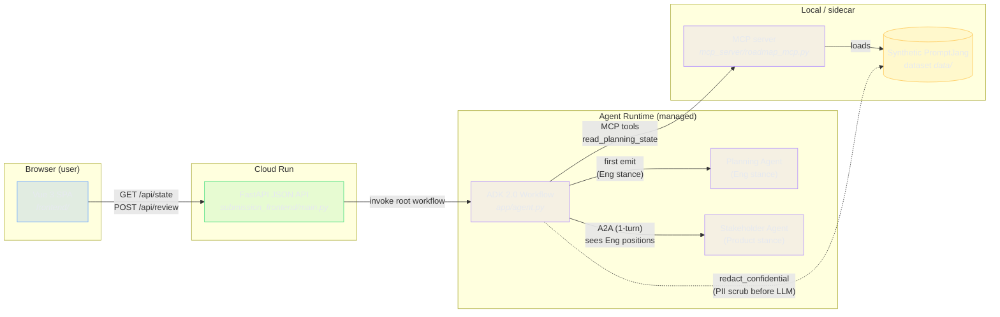
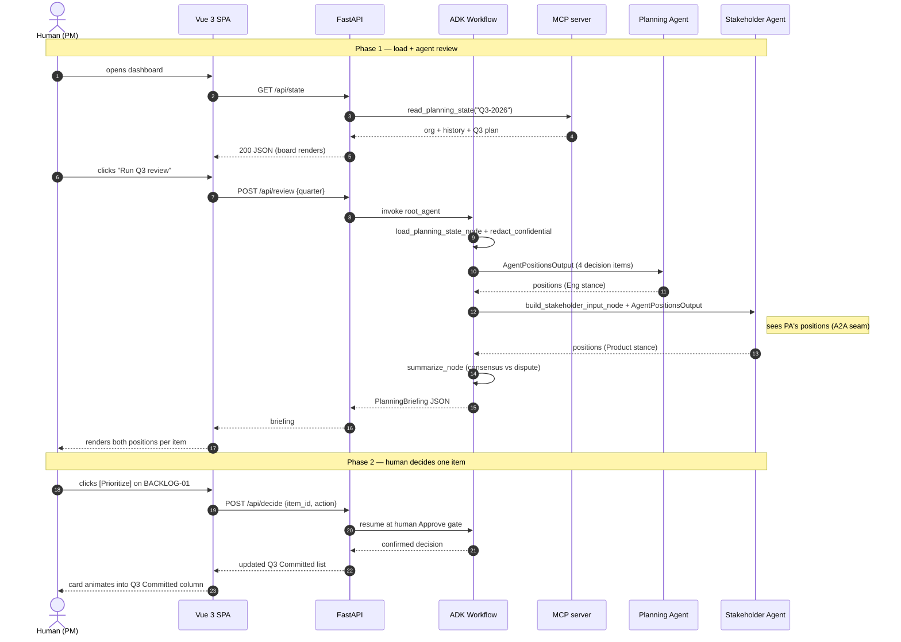
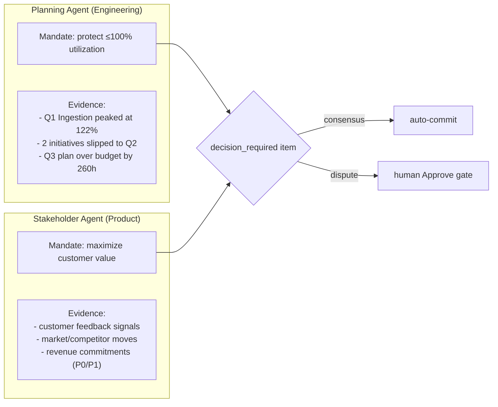
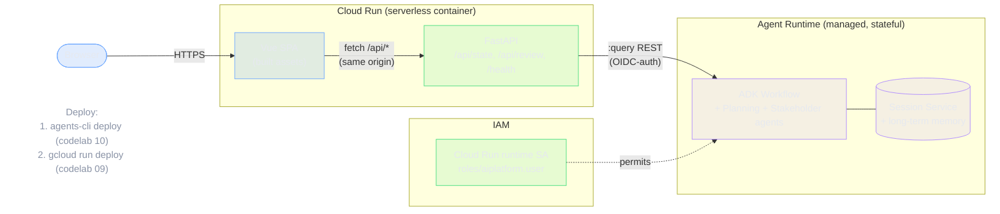

# Architecture & Interaction

Two views: the **component graph** (what runs where) and the **interaction sequence**
(what happens when the human clicks *Run Q3 review* then *Prioritize* on one item).

## 1. Component graph

## 2. Interaction sequence — one full decision

## 3. The two agents' mandates (why they disagree)

## 4. Decision-candidate beats (the demo's variety)

The four `decision_required` items each exercise a different agent-reasoning path:

| Item | Incoming state | Decision type | Stakeholder | Planning |
| --- | --- | --- | --- | --- |
| BACKLOG-01 Circuit Breakers | `not_started` | prioritize vs deprioritize | prioritize (renewal) | deprioritize (capacity) |
| BACKLOG-02 Ingestion debt | `partially_done` | prioritize vs deprioritize *(role-reversal)* | deprioritize (no revenue) | prioritize (prevents Q1 repeat) |
| BACKLOG-03 API Keys | `blocked` | unblock vs cut | unblock (audit gap) | cut (cheaper to revisit) |
| Q3-ING-01 Regional EU | `not_started` | prioritize vs defer_partial | prioritize (P0 revenue) | defer_partial (capacity) |

## 5. Google Cloud deployment topology (codelab 09 + 10)

**Two deploy commands, two targets:**

| Target | What lives there | How it deploys |
| --- | --- | --- |
| Agent Runtime | `app/agent.py` ADK workflow + bundled `data/` | `agents-cli scaffold enhance --deployment-target agent_runtime --yes` then `agents-cli deploy` (codelab 10) |
| Cloud Run | FastAPI + built Vue SPA | `gcloud run deploy` from the `Dockerfile` (codelab 09 source-deploy pattern) |

**Required env vars on Cloud Run:** `GOOGLE_CLOUD_PROJECT`, `GOOGLE_CLOUD_LOCATION`, `AGENT_RUNTIME_ID` (from `deployment_metadata.json` after the agent deploys).

**v1 vs v2 HITL:** v1 runs the agent synchronously per `/api/review` call (no `RequestInput` pause). v2 adds a HITL node so the agent pauses on Agent Runtime → the dashboard queries the Session Service for paused sessions → resumes on Approve (full codelab 09 flow).
